# Mess Away

O Mess Away é um aplicativo inovador projetado para ajudar na organização e gerenciamento de tarefas domésticas.

## Índice

- [1. Criação do Projeto com Vite](#1-criação-do-projeto-com-vite)
- [2. Instalação do React Router DOM](#2-instalação-do-react-router-dom)
- [3. Instalação do Material-UI](#3-instalação-do-material-ui)
- [4. Estrutura de Pastas](#4-estrutura-de-pastas)
- [5. Hierarquia de Renderização da Aplicação](#5-hierarquia-de-renderização-da-aplicação)

---

## 1. Criação do Projeto com Vite

**Por que Vite?** Optamos pelo Vite em vez do Create React App porque oferece:
- ⚡ Tempos de build significativamente mais rápidos
- 🔄 Melhor experiência de desenvolvimento com HMR mais eficiente
- ⚙️ Configuração mais moderna e flexível
- 📦 Menor tamanho do bundle final

### Comandos de instalação

```bash
npm create vite@latest FRONTEND -- --template react
cd FRONTEND
npm install
npm run dev
```

<details>
<summary>📋 Log de execução detalhado</summary>

#### Criação do projeto
```bash
@LeoPassos98 ➜ /workspaces/mess-away (main) $ npm create vite@latest FRONTEND -- --template react
│
◇  Package name:
│  frontend
│
◇  Scaffolding project in /workspaces/mess-away/FRONTEND...
│
└  Done. Now run:

  cd FRONTEND
  npm install
  npm run dev
```

#### Instalação das dependências
```bash
@LeoPassos98 ➜ /workspaces/mess-away/FRONTEND (main) $ npm install

added 153 packages, and audited 154 packages in 11s

32 packages are looking for funding
  run `npm fund` for details

found 0 vulnerabilities
```

#### Execução do servidor de desenvolvimento
```bash
@LeoPassos98 ➜ /workspaces/mess-away/FRONTEND (main) $ npm run dev

> frontend@0.0.0 dev
> vite

  VITE v7.1.6  ready in 334 ms

  ➜  Local:   http://localhost:5173/
  ➜  Network: use --host to expose
  ➜  press h + enter to show help
```

</details>

---

## 2. Instalação do React Router DOM

**Por que React Router?** É a biblioteca padrão para roteamento em React, oferecendo:
- 🗂️ Sistema de rotas aninhadas
- 🔒 Proteção de rotas
- 🧭 Navegação programática
- 📜 Histórico de navegação

### Comando de instalação

```bash
npm install react-router-dom
```

<details>
<summary>📋 Log de execução</summary>

```bash
@LeoPassos98 ➜ /workspaces/mess-away/FRONTEND (main) $ npm install react-router-dom

added 4 packages, and audited 158 packages in 1s

32 packages are looking for funding
  run `npm fund` for details

found 0 vulnerabilities
```

</details>

---

## 3. Instalação do Material-UI

**Por que Material-UI?** Foi escolhido porque oferece:
- 🎨 Sistema completo de componentes seguindo o Material Design
- ⚡ Acelera o desenvolvimento com componentes prontos e testados
- 🎯 Consistência visual e experiência padronizada
- 🛠️ Implementação simplificada de temas e customizações
- 📚 Documentação robusta com ampla comunidade

### 3.1 Instalação das dependências

```bash
npm install @mui/material @emotion/react @emotion/styled
npm install @mui/icons-material
```

<details>
<summary>📋 Logs de execução</summary>

#### Material-UI Core
```bash
@LeoPassos98 ➜ /workspaces/mess-away/FRONTEND (main) $ npm install @mui/material @emotion/react @emotion/styled

added 55 packages, and audited 213 packages in 8s

44 packages are looking for funding
  run `npm fund` for details

found 0 vulnerabilities
```

#### Ícones Material-UI
```bash
@LeoPassos98 ➜ /workspaces/mess-away/FRONTEND (main) $ npm install @mui/icons-material 

added 1 package, and audited 214 packages in 41s

45 packages are looking for funding
  run `npm fund` for details

found 0 vulnerabilities
```

</details>

### 3.2 Configuração do tema

Crie o arquivo `src/theme/theme.js`:

```javascript
// src/theme/theme.js
import { createTheme } from '@mui/material/styles';

const theme = createTheme({
  palette: {
    primary: {
      main: '#1976d2',
      light: '#42a5f5',
      dark: '#1565c0',
    },
    secondary: {
      main: '#dc004e',
      light: '#ff5983',
      dark: '#9a0036',
    },
  },
  typography: {
    fontFamily: '"Roboto", "Helvetica", "Arial", sans-serif',
  },
});

export default theme;
```

### 3.3 Configuração do Provider do tema

Atualize o arquivo `src/main.jsx`:

```javascript
// src/main.jsx
import React from 'react'
import ReactDOM from 'react-dom/client'
import { ThemeProvider } from '@mui/material/styles'
import CssBaseline from '@mui/material/CssBaseline'
import App from './App'
import theme from './theme/theme'
import './index.css'

ReactDOM.createRoot(document.getElementById('root')).render(
  <React.StrictMode>
    <ThemeProvider theme={theme}>
      <CssBaseline /> {/* Normaliza o CSS */}
      <App />
    </ThemeProvider>
  </React.StrictMode>,
)
```

<details>
<summary>🤔 O que é o Provider do tema?</summary>

#### 📡 Distribuidor de temas
O `ThemeProvider` é um componente do Material-UI que funciona como um "distribuidor de temas" para toda a aplicação. Ele usa o conceito de React Context para disponibilizar o tema para todos os componentes filhos.

#### ⚙️ Como funciona?
O Provider injeta o tema via React Context. Todos os componentes filhos acessam as configurações automaticamente.

**Sem ThemeProvider:**
```jsx
// Cada componente precisa receber cores manualmente
<Button color="#1976d2">Login</Button>
<Card backgroundColor="#f5f5f5">Conteúdo</Card>
```

**Com ThemeProvider:**
```jsx
// Componentes automaticamente usam o tema
<Button color="primary">Login</Button> // → #1976d2
<Card>Conteúdo</Card> // → background do tema
```

</details>

### 3.4 Atualização do arquivo HTML

Adicione as fontes Roboto e Material Icons no `index.html`:

```html
<!-- index.html -->
<!DOCTYPE html>
<html lang="en">
  <head>
    <meta charset="UTF-8" />
    <link rel="icon" type="image/svg+xml" href="/vite.svg" />
    <meta name="viewport" content="width=device-width, initial-scale=1.0" />
    <link
      rel="stylesheet"
      href="https://fonts.googleapis.com/css?family=Roboto:300,400,500,700&display=swap"
    />
    <link
      rel="stylesheet"
      href="https://fonts.googleapis.com/icon?family=Material+Icons"
    />
    <title>Mess Away</title>
  </head>
  <body>
    <div id="root"></div>
    <script type="module" src="/src/main.jsx"></script>
  </body>
</html>
```

<details>
<summary>🤔 Por que atualizar o index.html?</summary>

#### 🔤 Fontes do Google Fonts (Roboto)
O Material-UI foi projetado para usar a fonte Roboto por padrão. Sem ela, o browser usará uma fonte fallback (como Arial ou Helvetica), o que altera a aparência e quebra o design system do Material Design.

#### 🎯 Ícones Materiais (Material Icons)
O MUI usa ícones de texto que requerem a fonte de ícones específica.

</details>

---

## 4. Estrutura de Pastas

### 📁 Organização do projeto

```
FRONTEND/
├── 📄 README.md
├── ⚙️ eslint.config.js
├── 🌐 index.html
├── 📦 package.json
├── ⚙️ vite.config.js
├── public/
│   └── 🖼️ vite.svg
└── src/
    ├── 🎨 App.css
    ├── ⚛️ App.jsx
    ├── 🎨 index.css
    ├── ⚛️ main.jsx
    ├── 📁 assets/
    │   ├── 🖼️ images/
    │   │   ├── 🎯 icons/
    │   │   └── 🏷️ logos/
    │   └── 🎨 styles/
    ├── 📁 components/
    │   ├── 🔧 common/
    │   │   ├── Button/
    │   │   ├── Card/
    │   │   ├── Footer/
    │   │   └── Header/
    │   └── 🏗️ layout/
    │       ├── Layout/
    │       ├── Navbar/
    │       └── Sidebar/
    ├── 📁 context/
    ├── 📁 hooks/
    ├── 📁 pages/
    │   ├── Dashboard/
    │   ├── Home/
    │   ├── Login/
    │   └── Register/
    ├── 📁 services/
    ├── 📁 theme/
    │   └── theme.js
    └── 📁 utils/
```

### 📋 Explicação das pastas

| Pasta | Descrição | Conteúdo |
|-------|-----------|----------|
| **📁 assets/** | Arquivos estáticos | Imagens, ícones, estilos globais |
| **📁 components/** | Componentes reutilizáveis | Componentes básicos e de layout |
| **📁 pages/** | Páginas/views da aplicação | Cada página tem sua própria pasta |
| **📁 hooks/** | Custom hooks | Hooks personalizados reutilizáveis |
| **📁 utils/** | Funções utilitárias | Helpers, formatações, constantes |
| **📁 services/** | Comunicação com API | Serviços, APIs, configurações axios |
| **📁 context/** | Gerenciamento de estado | Contextos do React para estado global |

### 📂 Arquivos de configuração

| Arquivo | Descrição |
|---------|-----------|
| **⚙️ vite.config.js** | Configurações do Vite (build, plugins, server) |
| **⚙️ eslint.config.js** | Regras de linting e qualidade de código |
| **📦 package.json** | Dependências e scripts do projeto |
| **🌐 index.html** | Página HTML principal (ponto de entrada) |

### 📂 Arquivos principais da aplicação

| Arquivo | Descrição |
|---------|-----------|
| **⚛️ src/main.jsx** | Ponto de entrada do React (renderiza a aplicação) |
| **⚛️ src/App.jsx** | Componente raiz da aplicação |
| **🎨 src/App.css** | Estilos específicos do componente App |
| **🎨 src/index.css** | Estilos globais da aplicação |
| **🎨 src/theme/theme.js** | Configurações de design do Material-UI |

---

## 5. Hierarquia de Renderização da Aplicação

### 🏗️ Estrutura de Renderização Completa

Esta seção explica como a aplicação React é estruturada desde o ponto de entrada até a renderização final no navegador.

### 🔄 Fluxo de Renderização (Pipeline)

```jsx
<React.StrictMode>
  <BrowserRouter>
    <ThemeProvider theme={theme}>
      <CssBaseline />
      <App />
    </ThemeProvider>
  </BrowserRouter>
</React.StrictMode>
```

### 📋 Camadas da Aplicação

#### 1. **React.StrictMode** - Modo Estrito
- ⚡ **Desenvolvimento apenas** - Não afeta produção
- 🔍 **Identifica problemas antecipadamente** - Detecta efeitos colaterais
- 📝 **Avisa sobre práticas obsoletas** - APIs depreciadas e padrões antigos
- 🧪 **Execução dupla** - Testa consistência dos componentes

#### 2. **BrowserRouter** - Sistema de Rotas
- 🌐 **Controla navegação entre páginas** - Gerencia histórico do navegador
- 📍 **Monitora URL do navegador** - Sincroniza estado com a URL
- 🧭 **Habilita componentes de roteamento** - `<Link>`, `<NavLink>`, `<Navigate>`
- 🔄 **Navegação SPA** - Single Page Application sem recarregamento

#### 3. **ThemeProvider** - Gerenciador de Tema
- 🎨 **Distribui tema Material-UI** - Disponibiliza para toda aplicação
- 🎯 **Configurações centralizadas** - Cores, tipografia, espaçamentos
- 🎨 **Consistência visual** - Padrão unificado em todos os componentes
- 🛠️ **Customização global** - Mudanças refletem em toda aplicação

#### 4. **CssBaseline** - Normalizador CSS
- 🧹 **Remove estilos padrão inconsistentes** - Reset CSS inteligente
- 📏 **Padroniza base visual** - Consistência entre navegadores
- 🎯 **Cria fundação consistente** - Base sólida para estilos customizados
- ⚡ **Otimização automática** - Remove estilos desnecessários

#### 5. **App** - Componente Raiz
- 🏗️ **Define estrutura principal** - Layout base da aplicação
- 🧭 **Gerencia navegação** - Configuração de rotas e páginas
- 🔄 **Controla estado global** - Contextos e providers principais
- 🎯 **Orquestra componentes** - Coordena toda a aplicação

### 🎯 Ordem Correta é Essencial

A hierarquia deve ser mantida nesta ordem exata para garantir que:

- ✅ **O tema esteja disponível** em todos os componentes
- ✅ **O roteamento funcione corretamente** sem conflitos
- ✅ **Os estilos sejam consistentes** entre todas as páginas
- ✅ **A aplicação renderize sem erros** em qualquer navegador


### 🔍 Fluxo Detalhado Step-by-Step

| Etapa | Componente | Função | Resultado |
|-------|------------|---------|-----------|
| **1** | `ReactDOM.createRoot()` | 🚀 Inicializa React | Cria ponto de montagem |
| **2** | `<React.StrictMode>` | 🧪 Modo desenvolvimento | Detecta problemas |
| **3** | `<BrowserRouter>` | 🌐 Sistema de rotas | Habilita navegação |
| **4** | `<ThemeProvider>` | 🎨 Distribui tema | Aplica Material-UI |
| **5** | `<CssBaseline>` | 🧹 Normaliza CSS | Remove inconsistências |
| **6** | `<App>` | 🏗️ Componente raiz | Define estrutura |
| **7** | `<Routes> + <Route>` | 🗺️ Mapeamento de rotas | Define navegação |
| **8** | `<Layout>` | 📐 Estrutura comum | Header, Sidebar, Footer |
| **9** | `<Outlet>` | 🔄 Renderiza página atual | Mostra conteúdo dinâmico |
| **10** | `<Home>/<Login>/etc` | 📄 Conteúdo específico | Página final |
| **11** | **DOM Final** | 🎉 **Tela do navegador** | **Aplicação funcionando** |

<details>
<summary>🤔 Por que essa ordem é importante?</summary>

#### 🔄 Dependências em Cascata
Cada camada depende da anterior:

- **BrowserRouter** precisa estar **antes** dos componentes que usam roteamento
- **ThemeProvider** precisa estar **antes** dos componentes que usam o tema
- **CssBaseline** precisa estar **depois** do ThemeProvider para usar o tema
- **App** precisa de todas as camadas anteriores funcionando

#### ❌ Problemas com ordem incorreta:
```jsx
// ❌ ERRADO - Tema não estará disponível
<App>
  <ThemeProvider>
    <Button color="primary" /> // Erro: tema não definido
  </ThemeProvider>
</App>

// ✅ CORRETO - Tema disponível em toda App
<ThemeProvider>
  <App>
    <Button color="primary" /> // Funciona perfeitamente
  </App>
</ThemeProvider>
```
### 📊 Fluxo Simplificado (Do ReactDOM ao DOM)

```mermaid
graph TD
    A[ReactDOM.render] --> B[React.StrictMode]
    B --> C[BrowserRouter]
    C --> D[ThemeProvider]
    D --> E[CssBaseline]
    E --> F[App Component]
    F --> G[Routes]
    G --> H[Layout Component]
    H --> I[Outlet]
    I --> J[Páginas]
    
    J --> K[Home]
    J --> L[Login]
    J --> M[Register]
    J --> N[Dashboard]
    
    H --> O[Navbar]
    H --> P[Footer]
    
    style A fill:#e1f5fe
    style F fill:#fff3e0
    style J fill:#e8f5e8
    style O fill:#fce4ec
    style P fill:#f3e5f5
```


</details>

---
